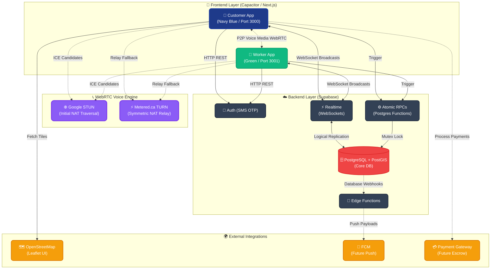

# Neighborly Trust - Master System Architecture & Technical Specifications

This document serves as the absolute source of truth for the **Neighborly Trust** ecosystem. It provides an exhaustive breakdown of the current architecture, the database schema, the real-time interaction loop, and the exact roadmap required to scale this platform for a production Play Store release.

---

## 1. System Architecture Diagram

The system operates on a split-frontend architecture, bound together by a unified Realtime PostgreSQL backend.

---

## 2. Exhaustive Current State Architecture (What We Have Now)

### 2.1 The Two-Sided Frontend Architecture
Neighborly Trust utilizes a **Monorepo / Split-App Architecture**. Rather than forcing complex role-based routing into a single app, the project separates the Customer experience from the Worker experience. Both apps share the same backend but run on different ports and compile to separate `.apk` files via Capacitor.

#### 2.1.1 The Customer App (`/src` - Port 3000)
- **Framework:** Next.js with React.
- **Styling:** Inline dynamic styling.
- **Core Components:**
  - `LoginScreen.tsx`: Handles SMS OTP authentication.
  - `MapScreen.tsx`: Integrates `react-leaflet` to render a live view of nearby workers (represented by custom markers).
  - `HomeScreen.tsx`: Allows users to voice-search or text-search for services.
  - `ProviderDetail.tsx`: The worker's public profile where customers initiate a booking.
  - `BookingsScreen.tsx`: Live dashboard for customers to track their active request (`searching`, `accepted`, `in_progress`).

#### 2.1.2 The Worker App (`/worker` - Port 3001)
- **Framework:** Next.js with React.
- **Core Components:**
  - `WorkerLoginScreen.tsx`: SMS OTP authentication, plus an onboarding flow for workers to select their service categories (`skills`).
  - `DashboardScreen.tsx`: The primary interface where workers toggle their "Online/Offline" status. Toggling online initiates a `navigator.geolocation.watchPosition` loop, continuously pushing their lat/lng to the database.
  - `JobOfferModal.tsx`: A globally injected modal that physically rings (HTML5 Audio) and overrides the screen when a new booking offer arrives via WebSockets.
  - `RequestsScreen.tsx`: Dashboard to manage accepted and active jobs.

### 2.2 The Supabase Backend & Database Schema
The backend is entirely serverless, relying on PostgreSQL Row Level Security (RLS) and custom functions.

#### Core Tables
1. **`profiles`**
   - *Columns:* `id` (UUID), `full_name`, `phone`, `role` (customer/worker), `preferred_language`, `created_at`.
   - *Purpose:* Base user account linked directly to Supabase Auth (`auth.users`).
2. **`worker_profiles`**
   - *Columns:* `profile_id` (FK), `bio`, `years_experience`, `is_online` (Boolean), `is_verified` (Boolean), `service_radius_km`, `location` (PostGIS `POINT`), `avg_rating`, `total_jobs`.
   - *Purpose:* Worker-specific metadata and live spatial tracking. The `location` column is indexed spatially for rapid radial queries.
3. **`service_categories`**
   - *Columns:* `id`, `name_en`, `icon_url`, `is_active`.
   - *Purpose:* Master list of allowed services (Plumber, Electrician, etc.).
4. **`worker_categories`**
   - *Columns:* `worker_id` (FK), `category_id` (FK).
   - *Purpose:* Many-to-many mapping of what skills a worker possesses.
5. **`bookings`**
   - *Columns:* `id`, `customer_id`, `worker_id` (Nullable initially), `category_id`, `status` (Enum: `searching`, `accepted`, `on_the_way`, `in_progress`, `completed`, `cancelled`), `customer_lat`, `customer_lng`.
   - *Purpose:* The central source of truth for a job's lifecycle.
6. **`booking_offers`**
   - *Columns:* `id`, `booking_id`, `worker_id`, `status` (`offered`, `accepted`, `declined`, `timed_out`), `offered_at`.
   - *Purpose:* A transient table used to track the "Ping" sent to a worker. 

#### Core Logic: The WebRTC Engine
The apps bypass cellular networks by using WebRTC for in-app voice calling.
1. When a job is `in_progress`, the `call` button becomes active.
2. The caller generates an `SDP Offer` and writes it to a transient Supabase table (or pushes it directly via Realtime Broadcasts).
3. The receiver intercepts the offer, generates an `SDP Answer`, and returns it.
4. ICE Candidates are exchanged using free Google STUN servers (`stun:stun.l.google.com:19302`) to establish the P2P connection.

---

## 3. The Core Booking Engine Lifecycle (Deep Dive)

The most complex engineering feat in the app is the Real-Time Spatial Booking Loop.

### Step 1: Spatial Querying (PostGIS)
When a customer clicks "Book", their exact `(lat, lng)` is sent to the backend. The backend executes a `ST_DWithin` PostGIS query on `worker_profiles`. It instantly filters out anyone who is:
1. Not `is_online = true`.
2. Not skilled in the requested `category_id`.
3. Geographically outside their defined `service_radius_km` from the customer.

### Step 2: The Broadcast (Supabase Realtime)
For every eligible worker found (e.g., 5 plumbers), the backend bulk-inserts rows into `booking_offers` with the status `offered`. 
- The **Worker App** maintains a live WebSocket subscription to `booking_offers` (`filter: worker_id=eq.${myId}`).
- The insertion instantly triggers a WebSocket packet to the 5 workers.
- The `JobOfferModal` mounts, plays an alarm sound, and shows the customer's distance and required service.

### Step 3: The Race Condition Lock (Atomic RPC)
If 5 plumbers receive the ping, they cannot all accept it. To prevent race conditions:
- When a worker clicks "Accept", the app fires a custom Postgres RPC function: `accept_booking_offer`.
- This RPC acts as a **mutex lock**. It checks if the `bookings.status` is still `searching`. 
- The *first* transaction to hit the database successfully updates the booking to `accepted` and assigns the `worker_id`. 
- The RPC immediately updates all other `booking_offers` for that job to `timed_out`. 
- The other 4 workers receive a WebSocket update that the offer was claimed, and their ringing modals disappear seamlessly.

---

## 4. Future Architecture Roadmap (What We Will Add)

To scale this prototype into a Play Store-ready production enterprise application, the following systems **must** be engineered and added to the architecture.

### 4.1 Payment Gateway & Escrow Automation
- **Current State:** Jobs end at `completed` with assumed off-platform cash exchanges. The platform cannot take its `COMMISSION_RATE`.
- **Future Architecture:** 
  - Integrate **Razorpay** or **Stripe Connect**. 
  - Customers must tokenize a card or UPI mandate prior to booking.
  - Funds are held in escrow when the job is `in_progress`.
  - Upon `completed`, the backend calculates the total (Base Fare + Time), deducts the platform commission, and executes a payout to the worker's linked bank account.

### 4.2 WebRTC TURN Servers & Phone Number Proxying
- **Current State:** Voice calling relies on free STUN servers. It fails on strict Symmetric NAT networks (like Jio LTE). Additionally, raw phone numbers are exposed to both parties via the API.
- **Future Architecture:** 
  - Integrate **Twilio Network Traversal Service (TURN)**. The backend will generate temporary TURN credentials allowing audio to relay through enterprise servers if P2P fails.
  - Integrate **Exotel or Twilio Proxy Calling**. If WebRTC fails completely, users can dial a generic proxy phone number that securely bridges the call without revealing actual mobile numbers (preventing disintermediation and harassment).

### 4.3 Mandatory KYC & Trust Verification
- **Current State:** A worker profile can be created via SMS OTP alone. Unvetted workers are a massive liability.
- **Future Architecture:**
  - Create an onboarding flow forcing workers to upload Government ID (Aadhar/PAN) and a live selfie.
  - Store encrypted media in **Supabase Storage**.
  - Worker profiles remain `is_verified = false` (unable to go online) until an external API (like IDfy or a human admin panel) verifies the documents.

### 4.4 Advanced Push Notifications (FCM Integration)
- **Current State:** The Supabase Edge function `notify-booking` is heavily mocked (`[FCM Mock] Missing FCM_SERVER_KEY`). Backgrounded apps are completely dead.
- **Future Architecture:**
  - Securely inject Google Service Account credentials into Supabase Secrets.
  - When `booking_offers` are generated, trigger an Edge Function that sends an **FCM High-Priority Data Message** to the worker's device token.
  - The Capacitor app must implement a background receiver to wake the CPU and trigger a local ringing notification even if the phone is locked in the worker's pocket.

### 4.5 Ratings, Dispute Resolution, and SOS
- **Current State:** No UI exists to rate a worker or ask for help.
- **Future Architecture:**
  - **Ratings Loop:** Upon job completion, force a modal on both apps. The customer rates the worker (1-5 stars) and leaves a text review. This data aggregates into the `avg_rating` column via a SQL trigger.
  - **SOS Button:** An emergency floating action button visible during `in_progress`. Pressing it sends an instant HTTP POST to the backend, which triggers an SMS to emergency contacts and alerts platform admins of a critical safety incident.
  - **Async Chat:** Implement a Supabase Realtime text chat so customers can send photos of broken items to workers before they arrive.
